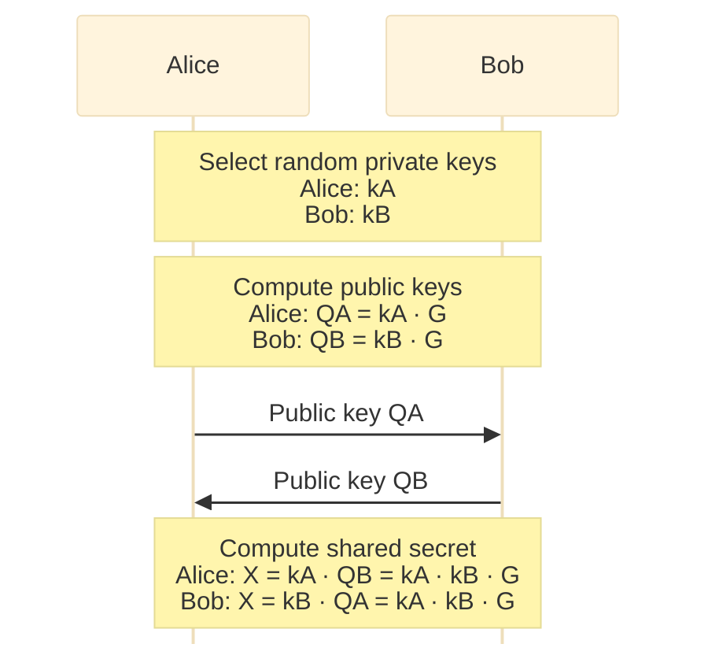
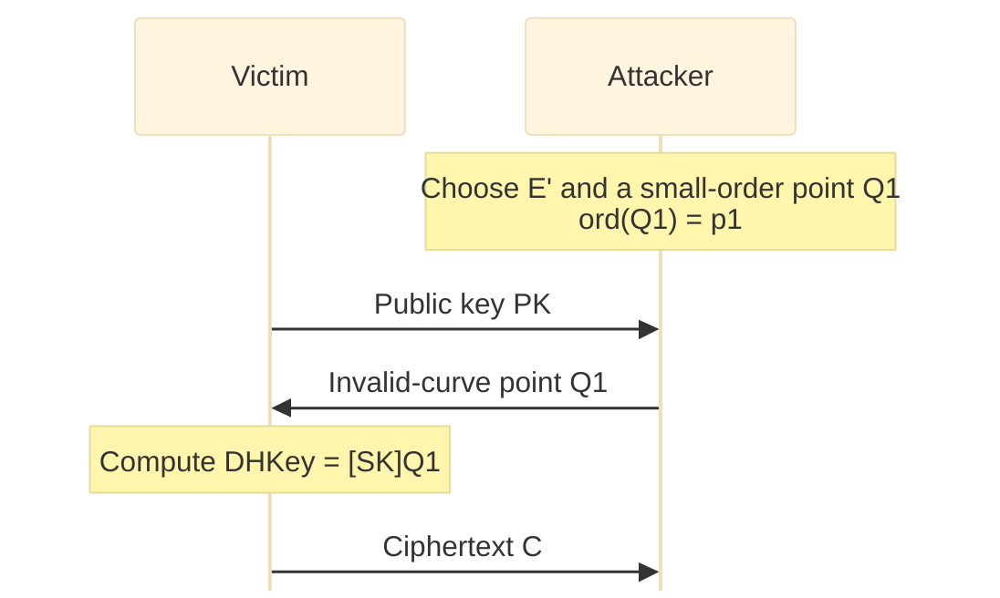

## Theory

### What is an elliptic curve?

Elliptic Curve, obviously, is a curved elliptic-like line. A familiar example is the curve $y = ax^2 + bx + c$ where the curve line yields all the set of $(x, y)$ satisfy the equation.

Now, when coming to cryptography, it would universally take the form:

$$
Y^2 = X^3+aX+b
$$

Equations of this type are called Weierstrass equations since according to the lore, a mathematician named Weierstrass studied and provided a foundational framework for them.

Examples:

  

     
    <em>Fig 1: $(a,b)=(-1,4)$</em>
  

  

     
    <em>Fig 2: $(a,b)=(-4,2)$</em>
  

### Properties

In the context of cryptography, elliptic curves are not defined over the set of real numbers, but rather over a finite field, also known as a Galois field. This means that all coordinates $(X, Y)$ and constants $(a, b)$ in the equation $Y^2 = X^3+aX+b$ are elements of a finite set of numbers, often over a prime field ($F_p$) or a binary one ($F_2^M$).

Another important thing about Elliptic Curve in cryptography is that is must be non-singular, like no sharp point, self intersect and stuff. It is to ensure that the operations on it and its points can be done without problems. We will get to know its operations right after this. But for now, an Elliptic curve has to satisfy $\Delta$ is non-zero with:

$$
\Delta=-16(4a^3+27b^2)
$$

### Points

Points on an elliptic curve are all pairs $(x, y)$ satisfy the according elliptic function, and an "infinity point" denoted $O$, serves as the identity element. The number of points on a curve (including $O$) is called "The order of the curve".

Elliptic curves are also symmetric to the $x$ axis. Which means that if the point $P = (x, y)$ is on the curve, then the point $-P = (x, -y)$ is also on the curve, and they are each other's "inverse".

### Point addition

In an elliptic curve, you can take two points on it and perform an "add" to get a third point. Adding on ECC is kinda different from the usual add we know so we will denote it by the symbol $\oplus$ (or you can just use normal "+" just pick what suits you).

For how it works, lets look at an example. Take two points $P$ and $Q$ on an elliptic curve $E$. To add them, we draw a line $L$ through $P$ and $Q$. Thus, the line will intersect with the curve $E$ at point $R$. Reflect the point $R$ across the $x$ axis to get its inverse $-R$, the $-R$ point is the sum of $P$ and $Q$:

$$
P \oplus Q = -R
$$

> **TODO:** Insert an illustration for point addition.

Some of the addition on ECC properties are like normal addition:

$$
(P+Q)+R = P+(Q+R)
$$

$$
P+Q = Q+P
$$

There are formulas to find the result $-R=(x_3,y_3)$. Let $E$ be an elliptic curve and let $P_1,P_2 \in E$.

1. If $P_1 = O$, then

   $$
   P_1 + P_2 = P_2
   $$

2. If $P_2 = O$, then

   $$
   P_1 + P_2 = P_1
   $$

3. Otherwise, write

   $$
   P_1=(x_1,y_1), \quad P_2=(x_2,y_2).
   $$

4. If $x_1=x_2$ and $y_1=-y_2$, then

   $$
   P_1+P_2=O
   $$

5. Otherwise, define the slope $\lambda$ by

   $$
   \lambda =
   \begin{cases}
   \dfrac{y_2-y_1}{x_2-x_1}, & \text{if }P_1\neq P_2, \\[1.2em]
   \dfrac{3x_1^2+A}{2y_1}, & \text{if }P_1=P_2.
   \end{cases}
   $$

Then compute:

$$
x_3=\lambda^2-x_1-x_2,\quad
y_3=\lambda(x_1-x_3)-y_1
$$

Thus:

$$
P_1+P_2=(x_3,y_3)
$$

Or you can just use Sage.

Now we know about the addition law in elliptic curve. Its time to know why the "Infinity point" exist. Lets add a point $P$ on the curve to its inverse $-P$. You can now see the line through them only intersect $E$ at 2 points $P$ and $-P$. The result of this addition is the "Infinity point":

$$
P+(-P)=O
$$

$$
P+O=P
$$

How about adding a point to itself? Adding a point $P$ to itself means $P=Q$, or the line $L$ is the tangent line to $E$ at $P$. The procedure is the same, line $L$ intersect with $E$ at $P$, $P$ and point $R$. Sum of $P$ and $P$ is $-R$. From this, we have "multiply" operation which is repeated addition:

$$
nP=P+P+P+\cdots+P
$$

### Why?

Previous computation/operation can be perform due to ECC is a group and has group's properties. So why is it a group?

Well, points on an Elliptic Curve form an Abelian group, since its addition law satisfies Group's properties:

1. **Identity**

   $$
   P+O=O+P=P \quad \forall P\in E
   $$

2. **Inverse**

   $$
   P+(-P)=O \quad \forall P\in E
   $$

3. **Associativity**

   $$
   (P+Q)+R=P+(Q+R) \quad \forall P,Q,R\in E
   $$

4. **Commutativity**

   $$
   P+Q=Q+P \quad \forall P,Q\in E
   $$

**Proof:**

The identity and the Inverse law are true, since we define $O$ to lies over all vertical lines, and since the Elliptic curve is symmetric, there always exist $P$ and $-P$.

For the Commutative law, this is true since line through $P$ and $Q$ is the same as the line through $Q$ and $P$ -> results in the same $R$.

The associative law is more complicated to proof. There is a proof in *Rational Points on Elliptic Curves*, book by Silverman and Tate. Its a bit long so I will left a link here if you want to know the proof. Now we know all points on an elliptic curve forms a group. It should have all group's properties.

### The Elliptic Curve Discrete Logarithm Problem (ECDLP)

This is where magic happens. We know (or not, if not then now we will <(")) that the Discrete Logarithm Problem (DLP) over a finite field $F_p$ (finite field is like you mod $p$ everything) is: Given $h$ and $g$, we have to find $x$ where:

$$
h \equiv g^x \pmod p
$$

The Elliptic Curve Discrete Logarithm Problem (ECDLP) is similar: Given 2 points $Q$ and $P$ on the curve. Our job is to find the secret integer $n$ satisfy:

$$
Q=P+P+P+\cdots+P=nP
$$

By analogy with the discrete logarithm problem for $F_p$, we denote this integer $n$ by

$$
n=\log_P(Q)
$$

There might exist points $Q$, $P$ over $E$ where $Q$ isn't a multiply of $P$. But in cryptography context, the public point $P$ is choosed first, then point $Q$ equals $nP$ is calculated and published later, so that $\log_P(Q)$ will always exist.

### Isogeny on Elliptic Curves

An **isogeny** is a special type of morphism between two elliptic curves that preserves the group structure. (Ánh xạ I guess)

Formally:

Let $E_1,E_2$ be elliptic curves defined over the same field.

An **isogeny** is a **non-constant rational map**

$$
\varphi:E_1\longrightarrow E_2
$$

that satisfies:

- $\varphi(O_{E_1})=O_{E_2}$ (the identity maps to the identity),
- and for all $P,Q\in E_1$:

$$
\varphi(P+Q)=\varphi(P)+\varphi(Q).
$$

**Intuition**

- Think of an isogeny as a **structure-preserving mapping** (ánh xạ bảo toàn cấu trúc) between elliptic curves.
- If $S=P+Q$ on $E_1$, then under an isogeny $\varphi$:

$$
\varphi(P)+\varphi(Q)=\varphi(S)
$$

which means the **group law is preserved**.

**Example**

- Suppose $E_1$ and $E_2$ are two elliptic curves.
- Let $\varphi:E_1\to E_2$ be an isogeny.
- If $P,Q\in E_1$ and $S=P+Q$, then:

$$
\varphi(P)+\varphi(Q)=\varphi(S).
$$

## Common Schemes

### Schemes

- The Elliptic-curve Diffie–Hellman (ECDH) key agreement scheme is based on the Diffie–Hellman scheme.
- The Elliptic Curve Integrated Encryption Scheme (ECIES), also known as Elliptic Curve Augmented Encryption Scheme or simply the Elliptic Curve Encryption Scheme.
- The Elliptic Curve Digital Signature Algorithm (ECDSA) is based on the Digital Signature Algorithm.
- The deformation scheme using Harrison's p-adic Manhattan metric.
- The Edwards-curve Digital Signature Algorithm (EdDSA) is based on Schnorr signature and uses twisted Edwards curves.
- The ECMQV key agreement scheme is based on the MQV key agreement scheme.
- The ECQV implicit certificate scheme.

### Elliptic-curve Diffie–Hellman (ECDH)

Like its name, Elliptic-curve Diffie–Hellman (ECDH) follows the same idea as standard Diffie-Hellman protocol, which is: On the agreed parameters $p,a,b,G,n$ ($a,b$ are the curve's coeffs, $G$ is the generation point, $n$ is its order), Alice and Bob each has a private key $k_a,k_b$ and a public key as point $Q_a,Q_b$ where $Q=nG$ to form a pair (($k_a,Q_a$) for Alice and ($k_b,Q_b$) for Bob). To get the shared secret one takes the other's public key $Q$ then multiply it with their own key. For example Alice will compute point $(x_1,y_1)=k_aQ_b$ and Bob will compute point $(x_2,y_2)=k_bQ_a$. Note that:

$$
k_aQ_b=k_a(k_bG)=k_b(k_aG)=k_bQ_a
$$

That means $x_1=x_2=X$. The coordinate $x$ in the result is the shared secret between them.

When both parties agree on an Elliptic Curve $E$ and a generator point $P\in E$, they communicate as follows:

### Elliptic Curve Digital Signature Algorithm (ECDSA)

You know ECDH is based on the Diffie–Hellman scheme. Now there's Elliptic Curve Digital Signature Algorithm (ECDSA), which is based on the Digital Signature Algorithm (DSA). It provide a way to verify the integrity and authenticity of data, ensuring a message hasn't been tampered with and was sent by the person who holds the private key. It is used in Blockchain (notably Bitcoin and Ethereum (I googled this)).

In ECDSA, the scheme utilizes the same shared elliptic curve parameters $p,a,b,G,n$ and consists of two primary steps in the process: signing and verification.

#### 1. Signing

Suppose Alice wants to sign a message $m$.

1. Alice generates a random private key $d_A$ and computes her public key $Q_A=d_AG$.
2. Alice hashes the message $m$ to get a hash value $h=HASH(m)$.
3. Alice selects a random integer $k$ (a nonce) and computes the point $R=kG$.
4. She takes the x-coordinate of point $R$ (let's call it $r$) and calculates $s=k^{-1}(h+rd_A)\pmod n$.
5. The pair $(r,s)$ is the digital signature for the message $m$.

#### 2. Verification

Suppose Bob receives the message $m$ and the signature $(r,s)$ from Alice. Bob already has Alice's public key $Q_A$.

1. Bob hashes the received message $m$ to get $h=HASH(m)$.
2. He computes $u_1=hs^{-1}\pmod n$ and $u_2=rs^{-1}\pmod n$.
3. He calculates the point $P=u_1G+u_2Q_A$.
4. He takes the x-coordinate of point $P$ (let's call it $x_P$) and compares it with $r$.
5. If $x_P\equiv r\pmod n$, the signature is valid. Otherwise, it is invalid.

#### Why does it work?

Let's look at the equation for point $P$:

$$
P=u_1G+u_2Q_A
$$

Substituting the formulas for $u_1$ and $u_2$:

$$
P=(hs^{-1})G+(rs^{-1})Q_A
$$

And substituting $Q_A$ with $d_AG$:

$$
P=(hs^{-1})G+(rs^{-1})(d_AG)
$$

$$
P=(hs^{-1}+rd_As^{-1})G
$$

$$
P=((h+rd_A)s^{-1})G
$$

From the signing step, we know that $s=k^{-1}(h+rd_A)$. This means $s^{-1}=(h+rd_A)^{-1}k$.

Substituting $s^{-1}$ back into the equation for $P$:

$$
P=((h+rd_A)(h+rd_A)^{-1}k)G
$$

$$
P=kG
$$

Thus, point $P$ is the same as the point $R$ Alice created during the signing process, which means their x-coordinates are equal, i.e., $x_P=r$.

This mechanism ensures that only someone with the private key $d_A$ can create a valid signature. Finding $d_A$ from $Q_A$, as we know, is the Elliptic Curve Discrete Logarithm Problem (ECDLP).

## Known Attacks

### Invalid Curve Attack

- The Invalid Curve Attack, introduced by Biehl et al., is a cryptographic attack where invalid group elements (points) are used in order to manipulate the group operations to reveal secret information.
- Let $SK$ be the secret key of the victim device and let $PK=[SK]G$ its public key.
- Let $E'$ be a different group defined by the curve equation

$$
E':y^2=x^3+ax+b' \pmod p,
$$

with the same **a** and a different **b** parameter.

By observing the output, the attacker can recover the victim’s secret key modulo $p_1$, and repeat the process with different curves to fully recover the key using the Chinese Remainder Theorem.

#### Singular Curve Attack

**A special case of Invalid Curve Attack**

In ECC, a curve is considered valid only if its discriminant

$$
\Delta=-16(4a^3+27b^2)\neq0\pmod p
$$

If **$\Delta=0\pmod p$**, the curve is singular, meaning it contains cusps or self-intersections, and the group law breaks down. The Elliptic Curve can be written as:

$$
E:y^2=(x-r)^2(x-s)\pmod p
$$

Where $r$ is the double root, $s$ is the single one.

**Then we "move" the curve to the left by $r$** (or replacing $x$ by $x+r$).

The Curve is now

$$
E:y^2=x^2(x+r-s)\pmod p
$$

So the singular point has moved to the origin. The value $t=(r-s)$ can help us to map from a point on the curve to an additive group $(\mathbb F_p,+)$. Thus reducing ECDLP to DLP which could be solved in subexponent time!!. For each point $(x,y)$ on the curve, it can be converted into $\displaystyle\frac{y+\sqrt t\,x}{y-\sqrt t\,x}$. Specifically, we can map $G$ and $Q$ to $g,q$ where

$$
q=g^n\pmod p
$$

This additive group has $order=p-1$ meaning that if it is a smooth order then the DLP can be solved efficiently thanks to **Pohlig–Hellman algorithm**. Finally, we calculate DLP and get the private key!

### Smooth-order Curve Attack

If you don't know yet, the order of a generator $G$ over a curve is defined as the number of that point add to itself till we got the Infinity $O$ or in other word, its order is $n$ where

$$
G\cdot n=O
$$

And the order of a curve (notation: $E(F_p)$) is the number of points on that curve including $O$ (Be sure to not mistaken them!!!).

For example, we got this curve

$$
E:Y^2=X^3+3X+8 \quad \text{over the field }\mathbb F_{13}.
$$

We can find number of points by substituting all possible values $X=0,1,\ldots,12$ and checking for which $X$ values the quantity $X^3+3X+8$ is a square modulo 13. Such as putting $X=0$ gives 8, and 8 is not a square modulo 13. Next we try $X=1$, which gives $1+3+8=12$. It turns out 12 is a square modulo 13 or in fact, it has two square roots

$$
5^2\equiv12\pmod{13}
\quad\text{and}\quad
8^2\equiv12\pmod{13}
$$

This gives two points $(1,5)$ and $(1,8)$ in $E(F_{13})$. Continuing in this fashion, we end up with a complete list

$$
E(F_{13})=
\{O,(1,5),(1,8),(2,3),(2,10),(9,6),(9,7),(12,2),(12,11)\}
$$

Thus $E(F_{13})$ consists of nine points.

#### Smooth Order

An order is called smooth if it factors into small prime components. Smoothness is useful in the context of the Elliptic Curve Discrete Logarithm Problem (ECDLP) because it allows the discrete logarithm to be solved more efficiently by reducing it modulo each prime divisor and then recombining results via the **Chinese Remainder Theorem (CRT)**. **But why and how does smooth order help us with that?**

#### Example

Suppose Alice selects a secret key $n_a\in\{1,2,3,\ldots,104\}$ and computes her public key:

$$
A=n_a\cdot G
$$

Instead of solving the full discrete logarithm problem directly in a group of order 105, we reduce the problem to smaller subgroups.

For each prime divisor $q\in\{3,5,7\}$, set

$$
h=\frac{\operatorname{ord}(G)}{q}
$$

For example, when $q=3$, we have $h=\frac{105}{3}$. Define

$$
\begin{aligned}
G'&=h\cdot G,\\
A'&=h\cdot A
   =h\cdot(n_a\cdot G)
   =n_a\cdot(h\cdot G).
\end{aligned}
$$

Thus, $G'$ is a generator of a subgroup of order $q$, and $A'$ lies in the subgroup generated by $G'$. Therefore, solving

$$
A'=n_a\cdot G'
$$

yields

$$
n_a\equiv k_q\pmod q
$$

Where $k_q$ is determined by discrete logarithm computation in the subgroup of order $q$.

Repeating the above procedure with $q=3,5,7$, we obtain congruences

$$
n_a\equiv k_3\pmod3,\qquad
n_a\equiv k_5\pmod5,\qquad
n_a\equiv k_7\pmod7
$$

Applying the Chinese Remainder Theorem (CRT) allows us to uniquely determine $n_a\pmod{105}$. Hence the ECDLP is efficiently solved.

In other words, instead of brute-forcing the entire $\operatorname{ord}(G)$, we can just reduce it to much smaller primes and solve it efficiently. This illustrates why cryptographic elliptic curves must be chosen so that the group order is not smooth. Instead, secure curves (e.g., secp256r1, secp256k1) have group orders with large prime factors, preventing such an attack.

### Smart’s Attack

If choosing smooth order is dangerous, now I gonna choose a prime order!! Hm let say using the same prime $p$ from modulus, my curve is now perfectly safe right?

*Well* **Yes** *but actually* **No**, indeed it can't be attacked using **Pohlig Hellman algorithm** but now since the curve is **Anomalous**, it is vulnerable to an attack so called **Smart's attack**. Before going into detail we need to go through some mathematical backgrounds.

#### Lift and Hensel's Lemma

Let say we have a polynomial $f(X)\in\mathbb Z[X]$ and we know an $x$ such that $f(x)\equiv0\pmod{p^s}$ and we want to find $x'\in\mathbb Z$ which satisfy both

$$
f(x')\equiv0\pmod{p^{s+1}}
\quad\text{and}\quad
x'\equiv x\pmod{p^s}.
$$

Let

$$
x'=x+\delta
\quad\rightarrow\quad
\delta\equiv0\pmod{p^s}.
$$

Using a Taylor expansion of $f$ around $x$:

$$
f(x')=f(x+\delta)
=f(x)+f'(x)\delta+\frac{f''(x)}{2!}\delta^2
+\frac{f'''(x)}{3!}\delta^3+\cdots
$$

Reducing modulo $p^{s+1}$, note that $\delta\equiv0\pmod{p^s}$ implies $\delta^2\equiv0\pmod{p^{2s}}$:

$$
f(x')=f(x+\delta)
\equiv f(x)+f'(x)\delta
\pmod{p^{s+1}}.
$$

Remind that $f(x')\equiv0\pmod{p^{s+1}}$, we assume $f'(x)$ is invertible and $u\cdot f'(x)\equiv1\pmod{p^{s+1}}$.

$$
\begin{aligned}
f(x)+f'(x)\delta &\equiv0\pmod{p^{s+1}},\\
\delta &\equiv\frac{-f(x)}{f'(x)}\pmod{p^{s+1}},\\
\delta &\equiv-u\cdot f(x)\pmod{p^{s+1}} \qquad \text{(1)}
\end{aligned}
$$

Finally substitute (1) in $x'=x+\delta$.

$$
x'=x+\delta
\equiv x-u\cdot f(x)
\pmod{p^{s+1}}. \tag{2}
$$

Relation (2) is the **key step** of **Hensel’s lemma**: it shows how a root modulo $p$ can be uniquely extended (or “lifted”) to a root modulo $p^2$. Here $x'$ is referred to as a lift of $x$ modulo $p^{s+1}$. We will be using this theorem to lift element from $\mathbb F_p$ to the field of $p$-adic numbers $\mathbb Q_p$ described next.

#### P-adic numbers

A $p$-adic number can be represent as:

$$
s=\sum_{i=k}^{\infty}a_ip^i
=a_kp^k+a_{k+1}p^{k+1}+a_{k+2}p^{k+2}+\cdots
$$

Where $k$ is an integer (possibly negative), and each $a_i$ is an integer such that $0\leq a_i<p$. A $p$-adic integer is a $p$-adic number such that $k\geq0$.

Note that $p$-adic number is similar to base-$p$, but instead of extending to the right, it extend to the left!

**For example**, convert $\frac15$ in **base 3 and 3-adic:**

$$
\begin{aligned}
\frac15
&=0.01210121\ldots\text{ (base 3)}
=0\cdot3^0+0\cdot3^{-1}+1\cdot3^{-2}+2\cdot3^{-3}+1\cdot3^{-4}+\cdots,\\
\frac15
&=\ldots121012102\text{ (3-adic)}
=\cdots+0\cdot3^5+1\cdot3^4+2\cdot3^3+1\cdot3^2+0\cdot3^1+2\cdot3^0.
\end{aligned}
$$

Wait isn't **3-adic** a bit weird $\ldots+2\cdot3^3+1\cdot3^2+0\cdot3^1+2\cdot3^0$ *must* be **greater** than $\frac15$. How could it be that way?

Well first, let talk about $p$-adic properties, we can do multiplication, addition and subtraction just like how we do it with normal numbers.

For example, in **10-adic** (I know 10 is not a prime but we'll talk abt it later), we can do like this:

| Addition | Multiplication | Subtraction |
| --- | --- | --- |
| $\ldots142857142857142$ $+\ldots345678345678345$ $=\ldots488535488535487$ | $\ldots857142857143$ $\times7$ $=\ldots000000000001$ | $\ldots987654321$ $-\ldots876543210$ $=\ldots111111111$ |

But why bothers using $p$-adic numbers when we can just using normal one?

It just overcomplicating things up.

Let talk about this:

$$
0.999999999\ldots=1
$$

The most straight-forward way to prove it is letting that number $0.999999999\ldots=k$. Then multiply $k$ by 10 and subtract by $k$ itself:

$$
\begin{aligned}
0.999999999\ldots&=k,\\
9.999999999\ldots&=10k,\\
9.999999999\ldots-0.999999999\ldots&=9k,\\
9&=9k,\quad k=1.
\end{aligned}
$$

Hmm, we were doing it in base 10, now what about **10-adic**? In **10-adic**, instead of going infinitely to the right, we're going to the left.

$$
\begin{aligned}
\ldots999999999&=m,\\
\ldots999999990&=10m,\\
\ldots999999999-\ldots999999990&=-9m,\\
9&=-9m,\quad m=-1.
\end{aligned}
$$

At first, it didn't make any sense that $\ldots999999999=-1$ at all. But when we add that number by $1$:

$$
\ldots999999999+1=\ldots000000000=0
$$

There should have been like a number $1$ on final digit of that series of $0$s, but it is an infinite number $9$ extend to the left so there wouldnt be 1 at all! hence it is equal to $0$.

This characteristic of $p$-adic number is very **important**! Not only it could represent **negative** numbers but also **rational** numbers without using $-$ symbol.

Also if a $p$-adic number is a non-ending of number $n$ ($0\leq n<p$). Then

$$
\ldots nnnnnn
=n\cdot p^0+n\cdot p^1+n\cdot p^2+n\cdot p^3+\cdots
=\frac{n}{1-p}
$$

For example $2$ in $3$-adic

$$
\ldots222222222=\frac{2}{1-3}=-1
$$

Now let go back to our curve but instead of doing over $\mathbb F_p$ (**Integer numbers**), we doing it over $\mathbb Q_p$ (**$p$-adic numbers**).

#### Lifting Curve modulo $p$

So normally, a point $P$ in Elliptic Curve $E:y^2=x^3+AX+B$ over $\mathbb F_p$ is something like

$$
P(x,y)
$$

Instead of $x,y$ in $\mathbb Z$, we are converting them to $p$-adic numbers!

$$
\begin{aligned}
x&=x_0+x_1p+x_2p^2+x_3p^3+x_4p^4+\cdots,\\
y&=y_0+y_1p+y_2p^2+y_3p^3+y_4p^4+\cdots.
\end{aligned}
$$

So a point $P$ in Elliptic Curve over $\mathbb Q_p$ is now

$$
P(x_0+x_1p+x_2p^2+\cdots,\,
  y_0+y_1p+y_2p^2+\cdots)
=P(x_0,y_0).
$$

About the curve coefficients when lifting:

When we lift the curve itself from $\mathbb F_p$ to $\mathbb Z/p^2\mathbb Z$, the coefficients also need to be lifted. Formally, one could choose any:

$$
A'=A+\alpha p,\qquad B'=B+\beta p
$$

with integers $\alpha,\beta$ since these reduce back to the original $A,B$ modulo $p$. This defines many possible lifts of the curve.

However, for Smart’s attack we don’t actually need exotic choices of $(A',B')$. It is enough to take the **canonical lift**, i.e. simply reuse the same coefficients $A'=A,\ B'=B$. This keeps the equation consistent and makes the exposition simpler.

When we lift this Curve to $E':y^2=x^3+A'x+B'$ modulo $p^2$, the $x,y$ in $P$ is extended by another degree as $P(x_0+x_1p,y_0+y_1p)$, but here's the question. How do we even know if theres even a **solution** for us to find? Maybe this attack was just dumb-guessing and ah-ha I found this messy method to crack the curve!

Well actually it is because of **Hensel's lemma** we have talked about previously. Don't mistake that we're not using the term $x'=x-uf(x)$, we only use that aforementioned lemma just to prove there should be exists solutions here for us to look for!

In **Elliptic Curve** $E':y^2=x^3+A'x+B'$ over $\mathbb Q_p$, there's this thing **$p$-adic Formal Group Logarithm ($\psi$)** which can be used to turn complex calculations like $Q=kP$ to simple one $\psi(Q)=k\cdot\psi(P)$.

Before we can define $\psi(P)$, we must introduce a new coordinate system. Our goal is to "zoom in" on the point at infinity $O$ and create a ruler to measure distances from it.

We define the local parameter $s$ at Infinity as:

$$
s=-\frac{x}{y}
$$

For a point $P$ on the curve, we write $s(P)$ to mean the **value** of this ratio calculated from $P$'s coordinates. This parameter has a crucial property: the point at infinity $O$ corresponds to $s=0$.

A point is said to be in the **formal group** (i.e., it is "infinitely close to $O$") if its $s$-coordinate is a $p$-adic integer divisible by $p$. In other words, $s(P)\in p\mathbb Z_p$.

Now, we can define the **$p$-adic elliptic logarithm**, $\psi$. For a point $P$ in the **formal group**, it is given by the following integral and its resulting power series:

$$
\begin{aligned}
\psi(P)
&=\int_{\infty}^{P}\frac{dx}{2y}\\
&=s(P)+\frac{a_1}{2}s(P)^2
+\left(\frac{a_1^2}{3}+\frac{a_2}{3}\right)s(P)^3+\cdots
\end{aligned}
$$

where $a_1,a_2,a_3$ are coefficients from a generalized Weierstrass equation

$$
y^2+a_1xy+a_3y=x^3+a_2x^2+a_4x+b.
$$

This function, $\psi$, is the **most important part** of Smart's attack. It is a **group homomorphism** from the **formal group** (with elliptic curve addition) to the **additive group** $p\mathbb Z_p$ (with regular addition). This means it satisfies:

$$
\psi(P+Q)=\psi(P)+\psi(Q)
$$

This is the property that linearizes the discrete logarithm problem. If $Q=kP$, then:

$$
\psi(Q)=\psi(kP)=k\cdot\psi(P)
$$

#### Simplification Curves

For the common curve $y^2=x^3+ax+b$, the coefficients $a_1,a_2,a_3$ are all zero. This causes the entire power series to collapse beautifully:

$$
\psi(P)
=s(P)+0\cdot s(P)^2+0\cdot s(P)^3+\cdots
=s(P).
$$

Therefore, $\psi(P)$ is now just $s(P)$.

#### The Attack

The attack proceeds by lifting the points $P$ and $Q=kP$ from $E(\mathbb F_p)$ to their canonical lifts $P'$ and $Q'$ in $E(\mathbb Q_p)$—that is, the unique lifts that lie in the formal group ($s(P')\in p\mathbb Z_p$).

Thanks to the homomorphism property and the simplification, we get:

$$
s(Q')=k\cdot s(P')
$$

But wait, why do we have to lift to $P',Q'$?

Why not just calculating

$$
s(Q)=k\cdot s(P)
$$

directly in $\mathbb F_p$? Couldn’t we simply compute

$$
s(P)=-\frac{x(P)}{y(P)}
\quad\text{and}\quad
s(Q)=-\frac{x(Q)_0}{y(Q)_0}
$$

modulo $p$ and solve $s(Q)\equiv k\cdot s(P)\pmod p$?

The answer is a no, and the reason is fundamental to the attack.

On an **Anomalous** curve $E/\mathbb F_p$, every nonzero point $P$ has order $p$. This mean that for modulo $p$, the naive $s(P)$ is not divisible by $p$ at all, so the $p$-adic logarithm $\psi(P)$ is not even defined there. In other words:

$$
s(P)=\frac{x_0}{y_0}\not\equiv0\pmod p
$$

So the $\psi(P)$ can't be approximated correctly at the level of $\mathbb F_p$.

This is why we lift. By lifting $P$ to $P'$ over $\mathbb Z/p^2\mathbb Z$, and then multiplying by $p$, the resulting point $pP'$ does land in the formal group (since its $s$-coordinate is divisible by $p$). At that point, the $p$-adic logarithm is well-defined, and its linearizing property applies.

Hence $k$ can be solve as:

$$
\begin{aligned}
s(pQ')&=k\cdot s(pP'),\\
k&\equiv\frac{s(pQ')}{s(pP')}
=\frac{p\cdot s(Q')}{p\cdot s(P')}
\pmod{p^2},\\
k&\equiv\frac{s(Q')}{s(P')}\pmod p.
\end{aligned}
$$

Before solving for $k$, we need to know coordinates of $P'$ and $Q'$ which is finding $x_1(Q),x_1(P),y_1(Q),y_1(P)$. Well it doesn't really matter at all, any point $P'$ can be multiply by $p$ in order to apply logarithm, so $x_1$ can be picked as any numbers like $0$ then `lift_x` to find $y_1$ lol.

### MOV (Menezes–Okamoto–Vanstone) Attack

Let $E$ be an elliptic curve defined over a finite field $\mathbb F_q$.

Let $n$ be a large prime that divides the number of rational points on the curve, denoted as $\#E(\mathbb F_q)$.

A **Pairing** (either a Weil or Tate Pairing) is a bilinear map:

$$
e_n:E[n]\times E[n]\longrightarrow\mu_n\subset\mathbb F_{q^k}^{\times}
$$

(briefed, from [Stanford's Weil Pairing notes](https://crypto.stanford.edu/pbc/notes/elliptic/weil.html))

In this context:

- **$E[n]$** is the subgroup of $n$-torsion points on the curve $E$, which are points $P$ satisfying $nP=O$, where $O$ is the point at infinity.
- **$\mu_n$** is the group of the $n$-th roots of unity, located within the extension field $\mathbb F_{q^k}$.

A pairing possesses the following crucial properties, making it a powerful tool in cryptography:

- **Bilinearity:** The operation on the pairing follows the laws of exponents.

  $$
  e_n(aP,bQ)=e_n(P,Q)^{ab}
  $$

  for any integers $a,b\in\mathbb Z$.

- **Non-degeneracy:** For any point $P$ other than the point at infinity ($P\neq O$), there always exists a point $Q$ such that the pairing value is not 1. This ensures the map is not trivial.

- **Alternating:** When the positions of the two points are swapped, the pairing value is inverted.

  $$
  e_n(P,Q)=e_n(Q,P)^{-1}
  $$

#### Embedding Degree

The **embedding degree** (denoted as $k$) with respect to the prime $n$ is the smallest positive integer that satisfies:

$$
n\mid(q^k-1)
$$

Now, for the attack. The MOV attack leverages a pairing $e_n$ to create a "projection" from the elliptic curve points to a finite field.

**Choose a Pairing:** Use a pairing $e_n$ (e.g., the Weil pairing) that maps two $n$-torsion points on the curve to an $n$-th root of unity. We then find an Auxiliary Point: Select a point $Q$ of order $n$ that is linearly independent of $P$. Due to the non-degeneracy of the pairing, we know that $e_n(P,Q)\neq1$.

Compute two values in the finite field:

- Compute the pairing of the base points:

  $$
  u=e_n(P,Q)
  $$

- Compute the pairing involving the target point:

  $$
  v=e_n(B,Q)=e_n(rP,Q)
  $$

Now, by the bilinear property of the pairing, we can simplify the second expression:

$$
v=e_n(rP,Q)=e_n(P,Q)^r=u^r
$$

The original problem is now reduced to a discrete logarithm problem in the finite field $\mathbb F_{q^k}$. We must find the exponent $r$ in the equation $v=u^r$.

This attack is viable for some curves with the embedding degree small enough (specially supersingular curves, where $k\leq6$) and can be simply avoided by not using curves with small embedding degree.

## References

- Joseph H. Silverman and John Tate, *Rational Points on Elliptic Curves*.
- [Weil Pairing — Stanford](https://crypto.stanford.edu/pbc/notes/elliptic/weil.html)
