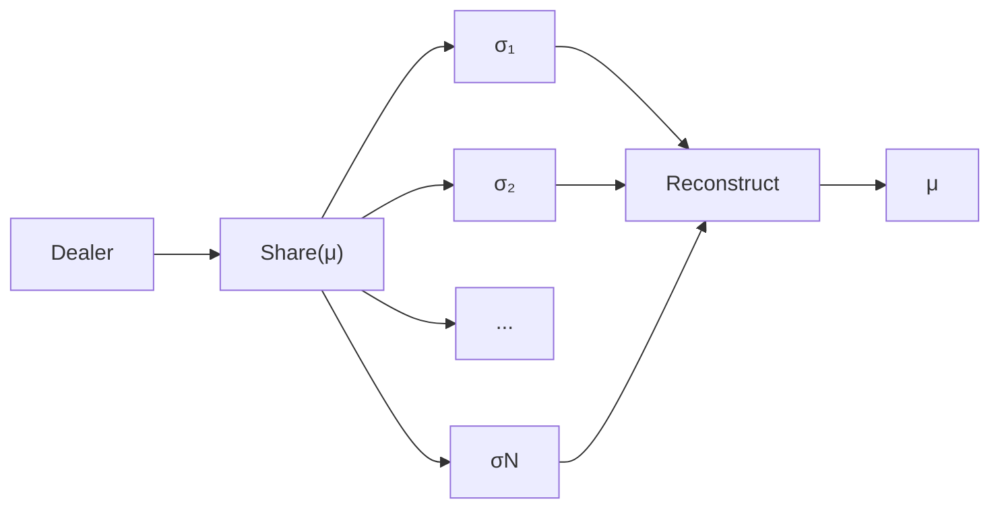
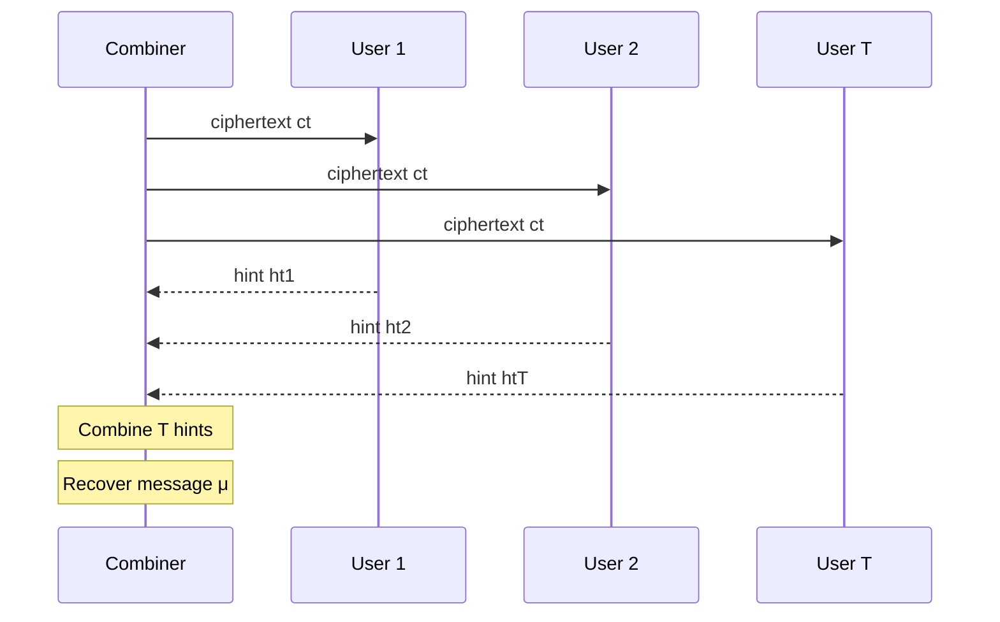

## Motivation

Say, if a group owns a valuable vault, how would you like it to be locked? If one person holds the entire key, that person becomes a **single point of failure**. If the key is leaked, the system is compromised. If the key is lost, the vault may become unrecoverable. If the key holder becomes unavailable, nobody else can use the secret. Or, maybe the first thing came to your mind, the key holder becomes greedy and take the vault for himself. A natural idea is therefore to split the key among several participants. Thus, a scheme is developed called secret sharing scheme.

Mike Rosulek gives a compact definition in *The Joy of Cryptography*:

> “Secret sharing is a way to encode a value M into several pieces, called shares.”[^joy]

Boneh and Shoup describe the threshold property as:

> “any t of the N shares are sufficient to reconstruct α, but every set of t − 1 shares reveals nothing about α.”[^boneh-shoup]

This is the basic idea of a **$T$-out-of-$N$ secret-sharing scheme**.

Let a secret $\mu$ be encoded into $N$ shares

$$
\sigma_1,\sigma_2,\ldots,\sigma_N.
$$

Any authorized set $S$ satisfying

$$
|S|\geq T
$$

should be able to reconstruct $\mu$, while a set with

$$
|S|<T
$$

should learn nothing about it.

One of the most elegant constructions achieving this is **Shamir Secret Sharing**, introduced by Adi Shamir in 1979.[^shamir79] The construction converts secret sharing into polynomial interpolation over a finite field.

The entire idea can be summarized by

$$
P(0)=\mu,
$$

and

$$
\sigma_i=P(i).
$$

The secret is hidden at one point of a random polynomial, and every participant receives another point on that polynomial.

---

## Secret Sharing

### Syntax

At a high level, a threshold secret-sharing scheme consists of two algorithms:

$$
\operatorname{Share}
\quad\text{and}\quad
\operatorname{Reconstruct}.
$$

The sharing algorithm is randomized:

$$
(\sigma_1,\ldots,\sigma_N)
\leftarrow
\operatorname{Share}(\mu).
$$

The reconstruction algorithm is deterministic:

$$
\mu
=
\operatorname{Reconstruct}
\left(S,\{\sigma_i\}_{i\in S}\right),
$$

where $S$ is an authorized set of participants.

This matches the standard syntax in Boneh and Shoup's Definition 22.1, where the sharing algorithm generates a $T$-out-of-$N$ sharing and the combining algorithm recovers the secret from a set of $T$ shares.[^boneh-shoup]

### Why Naive Secret Splitting Fails

The first idea one might try is to literally cut the secret into $N$ pieces:

$$
\mu
=
\sigma_1\Vert\sigma_2\Vert\cdots\Vert\sigma_N.
$$

All $N$ pieces are required to reconstruct $\mu$, so this appears to give an $N$-out-of-$N$ system.

However, it is **not secure secret sharing**.

Each individual share reveals part of the secret. For example, $\sigma_1$ directly reveals the first block of bits of $\mu$.

This illustrates an important distinction:

> Requiring several pieces for complete reconstruction does **not** imply that a smaller number of pieces reveals nothing.

Rosulek uses this exact failure mode as a motivating counterexample before constructing secure secret-sharing schemes.[^joy]

### 2-out-of-2 Secret Sharing from the One-Time Pad

The simplest secure example is a $2$-out-of-$2$ scheme.

Let

$$
\mu\in\{0,1\}^{\ell}.
$$

Choose a uniformly random value

$$
\sigma_1\leftarrow\{0,1\}^{\ell},
$$

and define

$$
\sigma_2=\sigma_1\oplus\mu.
$$

Then reconstruction is simply

$$
\sigma_1\oplus\sigma_2
=
\sigma_1\oplus(\sigma_1\oplus\mu)
=
\mu.
$$

Either share by itself is uniformly random, while both shares together recover the secret.

This is essentially the one-time pad viewed as a secret-sharing scheme.[^joy]

The problem is that this only gives us a fixed $2$-out-of-$2$ rule. We still need a general way to support arbitrary $T$ and $N$.

That is where polynomial interpolation appears.

---

## Polynomial Interpolation

### Why T Points Are Enough

A line is determined by two distinct points.

A quadratic polynomial is determined by three distinct points.

More generally:

> A polynomial of degree at most $d$ is uniquely determined by $d+1$ distinct points.

Therefore, a polynomial of degree at most $T-1$ is determined by exactly $T$ points.

This is the key observation behind Shamir Secret Sharing.[^shamir79][^joy]

Suppose

$$
P(X)
=
a_0+a_1X+\cdots+a_{T-1}X^{T-1}.
$$

If we know $T$ distinct pairs

$$
(x_1,P(x_1)),\ldots,(x_T,P(x_T)),
$$

we can reconstruct the entire polynomial.

In particular, we can recover

$$
P(0).
$$

### Lagrange Basis Polynomials

Given $T$ distinct points

$$
(x_1,y_1),\ldots,(x_T,y_T),
$$

define the Lagrange basis polynomial

$$
L_i(X)
=
\prod_{\substack{j=1\\j\neq i}}^T
\frac{X-x_j}{x_i-x_j}.
$$

These polynomials have a useful property:

$$
L_i(x_j)
=
\begin{cases}
1,&i=j,\\
0,&i\neq j.
\end{cases}
$$

Therefore the unique polynomial interpolating the points is

$$
P(X)
=
\sum_{i=1}^{T} y_iL_i(X).
$$

For secret sharing, we only care about the value at $X=0$:

$$
P(0)
=
\sum_{i=1}^{T}y_iL_i(0).
$$

Define

$$
\lambda_i
=
L_i(0)
=
\prod_{\substack{j=1\\j\neq i}}^T
\frac{-x_j}{x_i-x_j}.
$$

Then reconstruction becomes

$$
P(0)
=
\sum_{i=1}^{T}
\lambda_i y_i.
$$

These $\lambda_i$ values are the **Lagrange reconstruction coefficients**.

---

## Arithmetic over Finite Fields

Shamir Secret Sharing is not normally performed over the real numbers.

Instead, all arithmetic is done over a finite field such as

$$
\mathbb F_p
$$

for a prime $p$.

### Why We Work Modulo a Prime

The Lagrange formula contains divisions such as

$$
\frac{1}{x_i-x_j}.
$$

Division modulo $p$ means multiplication by a multiplicative inverse:

$$
a^{-1}a\equiv1\pmod p.
$$

When $p$ is prime, every nonzero element of $\mathbb F_p$ has an inverse.

Therefore, if the evaluation points are distinct modulo $p$, every denominator

$$
x_i-x_j
$$

is nonzero and invertible.

This is why polynomial interpolation works cleanly over $\mathbb F_p$.[^joy]

For the simple choice of user identifiers

$$
1,2,\ldots,N,
$$

we typically choose

$$
p>N
$$

so that these identifiers and $0$ are all distinct field elements.

---

## Shamir Secret Sharing

Shamir's original paper describes a $(k,n)$ threshold scheme where any $k$ pieces reconstruct the data while fewer pieces leave it undetermined.[^shamir79]

One concise line from the original paper captures the privacy goal:

> “knowledge of any k − 1 or fewer Dᵢ pieces leaves D completely undetermined”[^shamir79]

We will write the threshold as $T$ and the number of participants as $N$.

### Construction

Let the secret be

$$
\mu\in\mathbb F_p.
$$

Choose random coefficients

$$
a_1,\ldots,a_{T-1}
\leftarrow
\mathbb F_p
$$

and define the random polynomial

$$
P(X)
=
\mu
+
a_1X
+
a_2X^2
+
\cdots
+
a_{T-1}X^{T-1}.
$$

The important part is

$$
P(0)=\mu.
$$

For participant $i$, generate the share

$$
\sigma_i=P(i).
$$

Thus the $N$ shares are

$$
\sigma_1=P(1),\quad
\sigma_2=P(2),\quad
\ldots,\quad
\sigma_N=P(N).
$$

The process looks like this:

```text
                    P(X)
             degree at most T-1
                     |
       P(0) = μ ----+---- secret
                     |
       +-------------+-------------+
       |             |             |
    P(1)=σ₁       P(2)=σ₂       ... P(N)=σN
       |             |                 |
    User 1         User 2            User N
```

### Reconstruction

Suppose an authorized set

$$
S=\{i_1,\ldots,i_T\}
$$

provides its shares.

The combiner knows the $T$ points

$$
(i,\sigma_i)
\qquad
i\in S.
$$

Since $P$ has degree at most $T-1$, these $T$ points uniquely determine $P$.

We do not actually need to reconstruct every coefficient. Using Lagrange interpolation directly at zero gives

$$
\mu
=
P(0)
=
\sum_{i\in S}
\lambda_i\sigma_i,
$$

where

$$
\lambda_i
=
\prod_{\substack{j\in S\\j\neq i}}
\frac{-j}{i-j}
\pmod p.
$$

This linear reconstruction formula will become important later when we discuss threshold cryptography and noisy lattice computations.

---

## A Concrete 3-out-of-5 Example

Let

$$
T=3,\qquad N=5,
$$

and work over

$$
\mathbb F_{17}.
$$

Suppose the secret is

$$
\mu=5.
$$

Choose random coefficients

$$
a_1=2,\qquad a_2=7.
$$

Then

$$
P(X)=5+2X+7X^2\pmod{17}.
$$

The five shares are:

$$
\begin{aligned}
\sigma_1&=P(1)=14,\\
\sigma_2&=P(2)=3,\\
\sigma_3&=P(3)=6,\\
\sigma_4&=P(4)=6,\\
\sigma_5&=P(5)=3.
\end{aligned}
$$

Any three of these points determine the quadratic polynomial.

For example, users $1,3,5$ hold

$$
(1,14),\qquad(3,6),\qquad(5,3).
$$

Their Lagrange coefficients for interpolation at zero are

$$
\lambda_1
=
\frac{(0-3)(0-5)}{(1-3)(1-5)},
$$

$$
\lambda_3
=
\frac{(0-1)(0-5)}{(3-1)(3-5)},
$$

and

$$
\lambda_5
=
\frac{(0-1)(0-3)}{(5-1)(5-3)},
$$

with every operation interpreted in $\mathbb F_{17}$.

Then

$$
\mu
=
\lambda_1\sigma_1+
\lambda_3\sigma_3+
\lambda_5\sigma_5
\pmod{17}.
$$

The result is again

$$
\mu=5.
$$

> **Optional figure:** this is the best place to add a plot of the quadratic together with the five share points. A geometric plot is only intuition; the real scheme operates over the discrete field $\mathbb F_{17}$.

---

## Why T-1 Shares Reveal Nothing

Correctness follows from polynomial interpolation.

Security is the more interesting part.

Suppose an adversary obtains only $T-1$ shares:

$$
(i_1,\sigma_{i_1}),\ldots,(i_{T-1},\sigma_{i_{T-1}}).
$$

The adversary therefore knows only $T-1$ points of a degree-$(T-1)$ polynomial.

Now choose **any candidate secret**

$$
\mu'\in\mathbb F_p.
$$

The candidate adds one more point:

$$
(0,\mu').
$$

Together with the $T-1$ observed shares, this gives exactly $T$ points.

Therefore there exists a unique degree-$(T-1)$ polynomial $P'(X)$ satisfying all of them.

So the same observed $T-1$ shares are compatible with **every possible value of the secret**.

Because the nonconstant coefficients of the original Shamir polynomial are sampled uniformly, the distribution of the observed $T-1$ shares is independent of $\mu$.

This is the perfect-secrecy property formalized in standard secret-sharing definitions.[^boneh-shoup][^joy]

The key distinction is:

```text
T shares      -> unique polynomial -> unique secret
T - 1 shares  -> many polynomials  -> every secret remains possible
```

---

## From Secret Sharing to Threshold Cryptography

Secret sharing answers:

> How do we distribute a secret so that only an authorized group can reconstruct it?

Threshold cryptography asks a slightly different question:

> Can an authorized group **use** a cryptographic secret without first reconstructing the whole long-term key in one place?

Boneh and Shoup describe threshold cryptography as a technique for protecting secret keys in public-key systems, including threshold decryption and threshold signatures.[^boneh-threshold]

### Secret Reconstruction

Plain secret sharing looks like



The final output is the secret itself.

### Threshold Decryption

A threshold decryption system instead gives every participant a secret-key share.

Given a ciphertext $ct$, participant $i$ computes a **decryption share** or **decryption hint**:

$$
ht_i
\leftarrow
\operatorname{GetHint}(sk_i,ct).
$$

A combiner collects at least $T$ valid hints and recovers the plaintext:

$$
\mu
=
\operatorname{Combine}
(ct,\{ht_i\}_{i\in S}),
\qquad |S|\geq T.
$$

Conceptually:



The long-term master secret should ideally never need to appear in one location during decryption.

---

## Dealer-Based Setup vs Silent Setup

Classical Shamir sharing is easiest to describe with a **dealer**:

```text
Dealer
  |
  +-- chooses secret μ
  +-- chooses random polynomial P
  +-- computes all shares
  +-- privately sends σi to user i
```

Many threshold cryptographic systems instead generate shares of a secret key, often using a trusted dealer or a **distributed key generation (DKG)** protocol.

Boneh and Shoup discuss DKG as a way for servers to jointly establish a public key and individual secret-key shares without one party generating the full secret key.[^boneh-dkg]

The silent threshold encryption construction motivating this learning series targets an even more decentralized setup:

```text
User 1 generates (pk1, sk1)
User 2 generates (pk2, sk2)
...
User N generates (pkN, skN)
             |
             v
      public aggregation
             |
             v
    master public key
```

The setup is called **silent** because users do not need to run a global DKG protocol with one another during registration.

This is where ordinary Shamir sharing stops being the whole story: we still want the threshold property, but we want to obtain it without putting an $N$-user setup burden into every ciphertext.

---

## Why This Matters for Silent Threshold Encryption

### The Naive O(N) Direction

A generic way to build threshold decryption is to encrypt one suitable share for every user.

Conceptually:

```text
ct = (ct1, ct2, ..., ctN)
```

where $ct_i$ contains information intended for user $i$.

The obvious problem is

$$
|ct|=\Omega(N).
$$

Boneh and Shoup point out the same scalability issue for a generic threshold-decryption construction: ciphertext size and encryption time grow linearly with the number of servers $N$.[^boneh-generic-threshold]

The silent threshold encryption paper motivating this series wants the ciphertext to depend mainly on the threshold $T$, rather than linearly on all $N$ registered users.

### Exact Shares

Shamir reconstruction is exact:

$$
\mu
=
\sum_{i\in S}
\lambda_i\sigma_i.
$$

This means the shares being combined are exact field elements.

That assumption becomes important when we move to lattice cryptography.

### What Happens if the Shares Are Noisy?

Suppose instead that each available value is only an approximation

$$
\widetilde{\sigma}_i
=
\sigma_i+e_i,
$$

where $e_i$ is some error term.

Then Lagrange reconstruction gives

$$
\begin{aligned}
\sum_{i\in S}
\lambda_i\widetilde{\sigma}_i
&=
\sum_{i\in S}
\lambda_i(\sigma_i+e_i)\\
&=
\mu+
\sum_{i\in S}
\lambda_i e_i.
\end{aligned}
$$

The reconstructed value now contains the accumulated error

$$
e_{\mathrm{total}}
=
\sum_{i\in S}
\lambda_i e_i.
$$

If the Lagrange coefficients are large in the relevant representation, the errors may be amplified enough to destroy correctness.

This is exactly the kind of obstacle that appears when trying to combine threshold sharing directly with noisy LWE-style computations.

The next step in this learning path is therefore:

> **When Shamir Meets LWE: Why Noisy Shares Break Threshold Reconstruction**

---

## Takeaways

The main ideas to remember are:

1. A $T$-out-of-$N$ secret-sharing scheme allows any $T$ participants to reconstruct the secret while fewer than $T$ reveal nothing.

2. Shamir Secret Sharing encodes the secret as the constant term of a random degree-$(T-1)$ polynomial:

   $$
   P(0)=\mu.
   $$

3. User $i$ receives

   $$
   \sigma_i=P(i).
   $$

4. Any $T$ shares reconstruct the secret by Lagrange interpolation:

   $$
   \mu
   =
   \sum_{i\in S}
   \lambda_i\sigma_i.
   $$

5. With only $T-1$ shares, every candidate value of $\mu$ remains compatible with the observed shares.

6. Threshold cryptography goes beyond reconstructing a secret: participants use secret-key shares to jointly decrypt or sign.

7. The exact linear reconstruction of Shamir becomes problematic when the values being combined contain lattice noise.

The dependency chain for the next notes is now:

```text
Shamir Secret Sharing
        |
        v
Lagrange reconstruction
        |
        v
Threshold cryptography
        |
        v
What if shares are noisy?
        |
        v
Learning With Errors
```

---

## References

[^joy]: Mike Rosulek, *The Joy of Cryptography*, Chapter 3: “Secret Sharing,” MIT Press / open-access online edition. Sections 3.1–3.5 cover definitions, 2-out-of-2 sharing, interpolation, modular inverses, and Shamir sharing. <https://joyofcryptography.com/ss/>

[^boneh-shoup]: Dan Boneh and Victor Shoup, *A Graduate Course in Applied Cryptography*, Version 0.6, January 2023, Chapter 22, Definition 22.1 and Definition 22.2. <https://toc.cryptobook.us/book.pdf>

[^shamir79]: Adi Shamir, “How to Share a Secret,” *Communications of the ACM*, Vol. 22, No. 11, 1979, pp. 612–613. DOI: 10.1145/359168.359176. MIT-hosted copy: <https://web.mit.edu/6.857/OldStuff/Fall03/ref/Shamir-HowToShareASecret.pdf>

[^boneh-threshold]: Boneh and Shoup, *A Graduate Course in Applied Cryptography*, Chapter 22, “Threshold Cryptography,” especially the chapter introduction and Sections 22.1–22.3. <https://toc.cryptobook.us/book.pdf>

[^boneh-dkg]: Boneh and Shoup, *A Graduate Course in Applied Cryptography*, Chapter 22, discussion of distributed key generation and decentralized key provisioning. <https://toc.cryptobook.us/book.pdf>

[^boneh-generic-threshold]: Boneh and Shoup, *A Graduate Course in Applied Cryptography*, Section 22.3.1, discussion of the generic threshold-decryption construction and its linear dependence on $N$. <https://toc.cryptobook.us/book.pdf>
