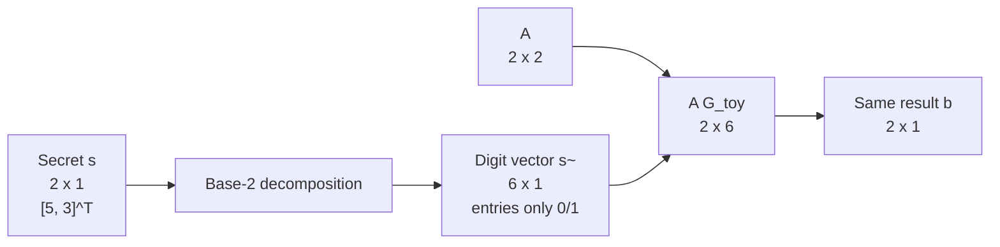
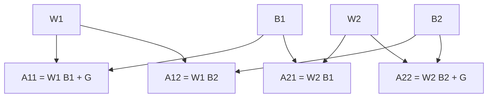
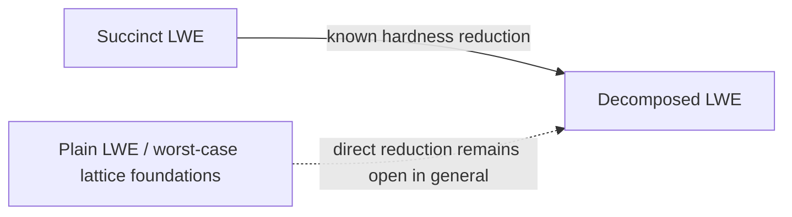

> **Prerequisite — Basic LWE:** this post assumes that you already know the basic Learning With Errors problem and the equation \(b = As + e \pmod q\).  
> Read my **[Basic LWE introduction](/posts/learning-with-errors/)** first if needed.
>
> <!-- Replace /posts/learning-with-errors/ with the URL of your own Basic LWE post. -->

## Theory

### 1. First: what does "decomposed" mean intuitively?

Before giving the formal **Decomposed LWE assumption**, it is useful to understand the gadget/base-decomposition idea that appears throughout lattice cryptography.

Start from a standard matrix-form LWE relation

\[
b = As + e \pmod q,
\]

where

\[
A \in \mathbb{Z}_q^{m\times n}, \qquad
s \in \mathbb{Z}_q^n, \qquad
e \in \mathbb{Z}^m.
\]

The entries of \(s\) live in \(\mathbb{Z}_q\), so an entry may be much larger than a binary digit.

A common lattice technique is to represent each coefficient using small base-\(B\) digits.

For one coefficient \(x\),

\[
x = \sum_{k=0}^{d-1} x_k B^k,
\qquad
x_k \in \{0,\ldots,B-1\}.
\]

For \(B=2\), the digits are simply bits.

The important trade-off is

\[
\boxed{
\text{short vector with larger coefficients}
\quad\longrightarrow\quad
\text{longer vector with small bounded coefficients}.
}
\]

This gadget intuition is extremely useful for understanding the notation that follows.

> **Important:** digit-decomposing a secret vector is **not by itself the formal Decomposed LWE assumption** of Abram, Malavolta, and Roy.  
> The formal assumption is a structured-LWE distinguishing problem described later in this post.[^laz]

---

## 2. A small matrix example

Let

\[
q=17,\qquad B=2,
\]

and choose

\[
A=
\begin{bmatrix}
3&4\\
2&5
\end{bmatrix},
\qquad
s=
\begin{bmatrix}
5\\
3
\end{bmatrix},
\qquad
e=
\begin{bmatrix}
1\\
-1
\end{bmatrix}.
\]

The ordinary LWE-style computation is

\[
b=As+e\pmod{17}.
\]

First compute

\[
As=
\begin{bmatrix}
3&4\\
2&5
\end{bmatrix}
\begin{bmatrix}
5\\
3
\end{bmatrix}
=
\begin{bmatrix}
27\\
25
\end{bmatrix}.
\]

Therefore,

\[
b=
\begin{bmatrix}
27\\
25
\end{bmatrix}
+
\begin{bmatrix}
1\\
-1
\end{bmatrix}
=
\begin{bmatrix}
28\\
24
\end{bmatrix}
\equiv
\boxed{
\begin{bmatrix}
11\\
7
\end{bmatrix}
}
\pmod{17}.
\]

### 2.1 Decompose the secret

For this **specific toy secret**, three binary digits are enough:

\[
5=(101)_2=1\cdot 2^0+0\cdot2^1+1\cdot2^2,
\]

and

\[
3=(011)_2=1\cdot 2^0+1\cdot2^1+0\cdot2^2.
\]

Thus

\[
\widetilde{s}
=
\begin{bmatrix}
1\\
0\\
1\\
1\\
1\\
0
\end{bmatrix}.
\]

Define the toy gadget matrix

\[
G_{\text{toy}}
=
\begin{bmatrix}
1&2&4&0&0&0\\
0&0&0&1&2&4
\end{bmatrix}.
\]

Then

\[
s = G_{\text{toy}}\widetilde{s}.
\]

Indeed,

\[
G_{\text{toy}}
\widetilde{s}
=
\begin{bmatrix}
1&2&4&0&0&0\\
0&0&0&1&2&4
\end{bmatrix}
\begin{bmatrix}
1\\0\\1\\1\\1\\0
\end{bmatrix}
=
\begin{bmatrix}
5\\3
\end{bmatrix}.
\]

The secret dimension has changed from

\[
2 \longrightarrow 6,
\]

but every coordinate of \(\widetilde{s}\) is only \(0\) or \(1\).

> For a gadget intended to represent **every** element of \(\mathbb{Z}_{17}\), we would normally take
>
> \[
> d=\lceil\log_2 17\rceil=5,
> \]
>
> not \(3\).  
> We use \(d=3\) here only because the selected toy values \(5\) and \(3\) fit in three bits.

---

### 2.2 Move the powers into the public matrix

Substitute

\[
s=G_{\text{toy}}\widetilde{s}
\]

into

\[
b=As+e.
\]

Then

\[
b=A(G_{\text{toy}}\widetilde{s})+e
=(AG_{\text{toy}})\widetilde{s}+e.
\]

Compute

\[
AG_{\text{toy}}
=
\begin{bmatrix}
3&4\\
2&5
\end{bmatrix}
\begin{bmatrix}
1&2&4&0&0&0\\
0&0&0&1&2&4
\end{bmatrix}.
\]

Hence

\[
AG_{\text{toy}}
=
\begin{bmatrix}
3&6&12&4&8&16\\
2&4&8&5&10&20
\end{bmatrix}.
\]

Modulo \(17\),

\[
\widetilde{A}
=
AG_{\text{toy}}
\bmod 17
=
\begin{bmatrix}
3&6&12&4&8&16\\
2&4&8&5&10&3
\end{bmatrix}.
\]

Now,

\[
b=
\widetilde{A}\widetilde{s}+e
\pmod{17}.
\]

Therefore,

\[
\begin{aligned}
b
&=
\begin{bmatrix}
3&6&12&4&8&16\\
2&4&8&5&10&3
\end{bmatrix}
\begin{bmatrix}
1\\0\\1\\1\\1\\0
\end{bmatrix}
+
\begin{bmatrix}
1\\-1
\end{bmatrix}
\\[4pt]
&=
\begin{bmatrix}
28\\24
\end{bmatrix}
\equiv
\boxed{
\begin{bmatrix}
11\\7
\end{bmatrix}
}
\pmod{17}.
\end{aligned}
\]

Nothing about the represented value changed.

We only changed its representation.

The dimensional trade-off is

\[
(2\times2)(2\times1)
\quad\longrightarrow\quad
(2\times6)(6\times1).
\]

More generally, if every secret coefficient uses \(d\) digits, then

\[
s\in\mathbb{Z}_q^n
\quad\longrightarrow\quad
\widetilde{s}\in\{0,\ldots,B-1\}^{nd}.
\]

The corresponding public matrix becomes wider by approximately a factor of \(d\).

This is why quantities such as

\[
\log q,\qquad n\log q,\qquad
\text{dimension},\qquad
\text{coefficient bounds}
\]

appear so often in lattice constructions.

---

## 3. The gadget matrix

The Lattice Assumption Zoo recalls the gadget matrix in the form[^laz]

\[
G_n = I_n\otimes g^T,
\]

where, for a base \(B\),

\[
g^T=
\begin{bmatrix}
1&B&B^2&\cdots&B^{d-1}
\end{bmatrix},
\]

with \(d\) chosen large enough to cover the modulus, typically

\[
d=\lceil\log_B q\rceil.
\]

For binary decomposition,

\[
B=2
\]

and therefore

\[
g^T=
\begin{bmatrix}
1&2&4&8&\cdots
\end{bmatrix}.
\]

For \(n=2\),

\[
G_2
=
I_2\otimes g^T
=
\begin{bmatrix}
g^T&0\\
0&g^T
\end{bmatrix}.
\]

The matrix in our toy example,

\[
G_{\text{toy}}
=
\begin{bmatrix}
1&2&4&0&0&0\\
0&0&0&1&2&4
\end{bmatrix},
\]

is exactly this block-gadget pattern, truncated to three powers for easier arithmetic.

---

# Formal Decomposed LWE

## 4. Why the toy example is not yet the assumption

The formal **Decomposed LWE** assumption was proposed by Abram, Malavolta, and Roy in 2025 in *Key-Homomorphic Computations for RAM: Fully Succinct Randomised Encodings and More*.[^amr]

It is not merely the statement

\[
s=G\widetilde{s}.
\]

Instead, it asks whether LWE samples remain pseudorandom when their public matrices have a particular structured form.

According to the Lattice Assumption Zoo, choose

\[
W_i \leftarrow \mathbb{Z}_q^{n\times m}
\]

uniformly and choose short matrices

\[
B_j \leftarrow D_{\sigma_B}^{m\times\widehat m}.
\]

For every

\[
i,j\in[\ell],
\]

construct

\[
\boxed{
A_{i,j}=W_iB_j+\delta_{i,j}G
}
\]

where

\[
\delta_{i,j}
=
\begin{cases}
1,&i=j,\\
0,&i\neq j.
\end{cases}
\]

Thus the gadget term appears only on the diagonal.

Choose one shared secret

\[
s\leftarrow\mathbb{Z}_q^n
\]

and small errors

\[
e_{i,j}\leftarrow D_{\sigma_e}^{\widehat m}.
\]

The LWE-style outputs are

\[
\boxed{
b_{i,j}
=
s^T A_{i,j}+e_{i,j}
\pmod q.
}
\]

The assumption says, informally, that an efficient adversary should not be able to distinguish these structured noisy outputs from uniformly random vectors of the same dimension.[^laz]

---

## 5. Visualizing the formal structure for \(\ell=2\)

The notation becomes much easier when we set

\[
\ell=2.
\]

There are four structured matrices:

\[
A_{1,1}=W_1B_1+G,
\]

\[
A_{1,2}=W_1B_2,
\]

\[
A_{2,1}=W_2B_1,
\]

\[
A_{2,2}=W_2B_2+G.
\]

So the structure is

\[
\boxed{
\begin{array}{c|cc}
 & B_1 & B_2\\
\hline
W_1 & W_1B_1+G & W_1B_2\\
W_2 & W_2B_1 & W_2B_2+G
\end{array}
}
\]

and every block produces

\[
b_{i,j}=s^TA_{i,j}+e_{i,j}.
\]

This block structure is much closer to what **Decomposed LWE** actually means in the literature than simply writing a secret in binary.

---

## 6. What is the distinguishing game?

A useful way to remember LWE assumptions is as a game.

### Real world

The adversary receives public structure such as

\[
W_i,\quad B_j
\]

together with

\[
b_{i,j}=s^TA_{i,j}+e_{i,j}.
\]

The same hidden secret \(s\) participates across the structured samples.

### Random world

The public matrices are distributed as required by the assumption, but the corresponding \(b_{i,j}\) values are replaced by uniformly random vectors of matching dimension.

The adversary must guess whether it is seeing the real world or the random world.

The **Decomposed LWE assumption** states that no efficient adversary can distinguish the two with non-negligible advantage for the intended parameter regime.[^laz]

---

## 7. Where is the "decomposition"?

There are two related ideas that should not be conflated.

### Gadget/base decomposition

We can represent a value using many small digits:

\[
x
\longleftrightarrow
(x_0,\ldots,x_{d-1}),
\]

with

\[
x=\sum_k x_k B^k.
\]

This explains why gadget vectors contain powers of the base.

### Decomposed LWE assumption

The formal assumption instead exposes LWE samples whose public matrices are built from pieces

\[
W_iB_j
\]

plus the diagonal gadget correction

\[
\delta_{i,j}G.
\]

So the name refers to a **structured decomposition of the LWE matrix/sample system**, not simply to replacing the secret with its bit representation.

The gadget-decomposition example remains useful because it gives the right intuition for

\[
G
\]

and for the dimension-versus-coefficient trade-off.

---

## 8. Why is this useful?

The original work uses Decomposed LWE as a foundation for advanced cryptographic constructions, including succinct randomised encodings and attribute-based encryption for RAM programs.[^amr]

The Lattice Assumption Zoo also lists constructions based on Decomposed LWE such as:[^laz]

- Succinct Randomised Encodings,
- Attribute-Based Encryption,
- Constrained PRFs,
- Broadcast Encryption,
- Distributed Monotone-Policy Encryption.

The reason structured assumptions like this are useful is that cryptographic constructions often need more algebraic organization than an entirely uniform LWE matrix provides.

The challenge is to expose useful structure without making the hidden LWE secret distinguishable.

---

# Hardness

## 9. Relation to Succinct LWE

Abram, Malavolta, and Roy show a reduction from the hardness of \(\ell\)-Succinct LWE to Decomposed LWE for an appropriate parameter regime.[^amr][^laz]

The Lattice Assumption Zoo summarizes a setting with

\[
\widehat m=n\log q,
\]

prime \(q\), polynomial \(\ell\),

\[
m\ge 2\widehat m,
\]

and an appropriate polynomial noise ratio.[^laz]

Conceptually:

The original paper emphasizes that Decomposed LWE does **not** explicitly involve a lattice trapdoor in the assumption itself, and interprets the assumption as being similar in spirit to a circular-security assumption.[^amr]

This is an important distinction:

> Decomposed LWE should not currently be described as "just standard LWE with another notation."

The structured public matrices are part of the security assumption.

---

## 10. Open questions

The Lattice Assumption Zoo records several open directions, including:[^laz]

- obtaining stronger concrete hardness results for some parameter regimes,
- determining whether attacks can exploit the \(\ell\)-structured form more efficiently than generic SIS/LWE attacks,
- establishing hardness with respect to the structured \(A\) matrix from a worst-case lattice problem.

So when using Decomposed LWE in a research project, the exact assumption and parameter regime should always be stated explicitly.

---

# Practical Intuition

## 11. What should I remember?

If you only remember the warm-up intuition, remember

\[
\boxed{
\text{dimension increases}
\quad\text{while}\quad
\text{individual digit coefficients become small}.
}
\]

For example,

\[
s=
\begin{bmatrix}
5\\3
\end{bmatrix}
\]

can be represented by

\[
\widetilde{s}
=
\begin{bmatrix}
1\\0\\1\\1\\1\\0
\end{bmatrix}.
\]

Then

\[
As
=
AG_{\text{toy}}\widetilde{s}.
\]

But if you are discussing the **formal security assumption**, remember the equation

\[
\boxed{
A_{i,j}=W_iB_j+\delta_{i,j}G
}
\]

and the corresponding samples

\[
\boxed{
b_{i,j}=s^TA_{i,j}+e_{i,j}.
}
\]

These are two different levels of understanding:

1. **gadget decomposition** explains the mechanism and intuition;
2. **Decomposed LWE** specifies a structured computational indistinguishability assumption.

---

# Code

A small implementation is useful for learning, but there is no need to pretend that a toy script "implements the security assumption."

A good educational repository should contain:

1. base-\(B\) decomposition of a vector;
2. gadget-matrix construction;
3. reconstruction \(s=G\widetilde{s}\);
4. verification that

   \[
   As+e=(AG)\widetilde{s}+e\pmod q;
   \]

5. a toy constructor for

   \[
   A_{i,j}=W_iB_j+\delta_{i,j}G.
   \]

The accompanying demo repository for this post does exactly that.

---

# Summary

The path from ordinary LWE to Decomposed LWE is easiest to learn in two stages.

First, gadget decomposition teaches us how a vector with larger coefficients can be represented by a longer vector of small digits:

\[
s=G\widetilde{s}.
\]

This creates a useful trade-off between dimension and coefficient size.

Second, the formal Decomposed LWE assumption introduces structured public matrices

\[
A_{i,j}=W_iB_j+\delta_{i,j}G
\]

and assumes that the resulting noisy linear samples

\[
s^TA_{i,j}+e_{i,j}
\]

remain computationally indistinguishable from random.

That second statement—not merely binary expansion of the secret—is the cryptographic assumption.

---

# References

[^laz]: Lattice Assumption Zoo, **“Decomposed LWE.”** Updated May 6, 2026. <https://latticeassumptionzoo.org/decomposed-lwe/>

[^amr]: Damiano Abram, Giulio Malavolta, and Lawrence Roy, **“Key-Homomorphic Computations for RAM: Fully Succinct Randomised Encodings and More.”** CRYPTO 2025; Cryptology ePrint Archive, Paper 2025/339. <https://eprint.iacr.org/2025/339>
